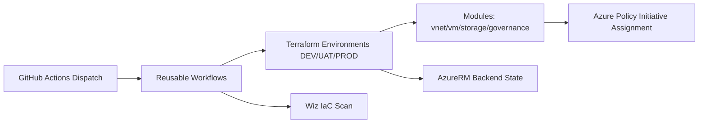

# Terraform Azure Platform

## Architecture Overview
Enterprise Terraform platform for Opella with reusable Azure modules, GitHub Actions orchestration, OIDC auth, and governance as code.



## Repository Structure
- `modules/vnet`: VNET/subnet/NSG/route/private DNS support.
- `modules/vm`: Linux VM fleet with MI, SSH, diagnostics.
- `modules/storage`: Secure storage + containers + lifecycle policies.
- `modules/governance`: Policy initiative and assignment.
- `environments/dev|uat|prod`: environment compositions.
- `.github/workflows`: dispatch + reusable CI/CD.
- `tests/go`: Terratest examples.

## CIDR and Segmentation
DEV `10.10.0.0/16`, UAT `10.15.0.0/16`, PROD `10.20.0.0/16`; each split into management, application, data, private-endpoint, and reserved future subnet. This prevents overlap and preserves peering/hybrid readiness.

## Naming and Tags
Locals centralize naming (`rg-opella-dev-eastus`, `vnet-opella-dev-eastus`, `vm-opella-dev-eastus-001`, `stopelladeveus001`). Common tags use `merge()` with mandatory governance tags.

## Governance as Code
Initiative: **Opella-Governance-Baseline** with Require Tags, Allowed Regions, Deny Public IP. Assigned at RG scope for environment isolation. Future OPA integration can map policy intent for cross-cloud parity.

## Backend and Init
`backend.tf` is empty config; runtime values injected from GitHub Environment Secrets.

Example:
```bash
terraform init \
  -backend-config="resource_group_name=$TF_BACKEND_RESOURCE_GROUP" \
  -backend-config="storage_account_name=$TF_BACKEND_STORAGE_ACCOUNT" \
  -backend-config="container_name=$TF_BACKEND_CONTAINER" \
  -backend-config="key=$TF_BACKEND_KEY"
```

## GitHub Actions Design
- `iac-dispatch.yml`: central workflow_dispatch router.
- `terraform-validate.yml`: fmt/init/validate/terraform-docs/tflint.
- `terraform-plan.yml`: init/validate/tflint/wiz scan/plan/upload.
- `terraform-apply.yml`: apply planned artifact.
- Destroy workflows: planned destruction with gated apply.
- `policy-validation.yml`, `docs-validation.yml`: PR controls.

## Security Controls
- GitHub OIDC only (no client secrets).
- Backend state in secured storage.
- Public access disabled for storage.
- Optional no-public-IP stance via policy.
- Wiz scan in planning stage.

## Release Lifecycle
Validate → Plan → Apply (or Destroy Plan → Destroy Apply), with PROD manual approval at environment protection layer.

## Terraform-docs Inputs/Outputs
Each module exposes variables/outputs via `variables.tf` and `outputs.tf` for auto-doc generation.

## Interview Talking Points
- Why policy initiative over individual assignments.
- Why backend injection from environment secrets.
- Why lifecycle protection on critical network resources.
- Why environment-specific approvals in GitHub Environments.
